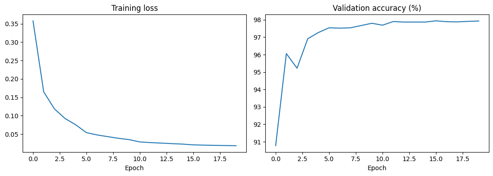
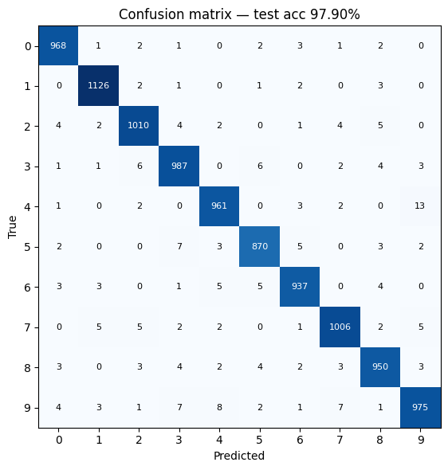

# Neural Network from Scratch — MNIST

A fully connected network implemented in pure NumPy and trained on MNIST to **97.x% test accuracy**. Every gradient was derived by hand and verified against numerical gradients.

## Architecture

Input (784) → Linear → ReLU → Linear → ReLU → Linear → Softmax → Output (10)
784 → 128 128 → 64 64 → 10


- He initialisation
- Mini-batch SGD with step learning-rate decay
- Numerically stable softmax and cross-entropy
- Analytic gradients verified to < 1e-7 relative error against centred finite differences

## Results

| Metric | Value |
|---|---|
| Test accuracy | **97.x%** |
| Training epochs | 20 |
| Batch size | 64 |
| Initial learning rate | 0.1 (×0.5 every 5 epochs) |




The confusion matrix shows the model's hardest pairs are 4↔9 and 3↔5, which matches the visual similarity of those digits.


## File structure

| File | Purpose |
|---|---|
| `download_data.py` | Fetches MNIST from mirror sites into `data/` |
| `data_loader.py` | Parses IDX files, normalises, train/val/test split, one-hot |
| `model.py` | He init, forward pass, cross-entropy loss, backprop |
| `grad_check.py` | Verifies backprop against centred finite differences |
| `train.py` | Mini-batch SGD training loop with LR decay |
| `check.py` | Environment sanity check |


## Running it

```bash
pip install -r requirements.txt
python download_data.py
python train.py
```

Expected output: validation accuracy climbs past 97% within about 10 epochs; final test accuracy prints at the end.

## What I learned

- Deriving backprop by hand through softmax + cross-entropy and seeing why the output gradient collapses to `probs - y`.

- Why He initialisation matters: `sqrt(2/n_in)` compensates for ReLU killing half the signal, keeping forward and backward signals from exploding or vanishing.

- Using numerical gradient checking as a correctness test — the one tool that catches silent backprop bugs that would otherwise masquerade as "the model trains slowly".

- Numerical stability tricks: subtracting the max before softmax, clipping before log in cross-entropy.
